# Traffic System Roles and Permissions

## Role Hierarchy Diagram

## Detailed Access Control Matrix

```mermaid
graph LR
    subgraph Features
        F1[Dashboard]
        F2[Traffic Offenses]
        F3[Payments]
        F4[Drivers]
        F5[Reports]
        F6[Settings]
        F7[User Management]
        F8[System Config]
    end

    subgraph Access Levels
        A1[Full Access]
        A2[Write Access]
        A3[Read Access]
        A4[No Access]
    end

    subgraph Legend
        L1[🟢 Full Access]
        L2[🟡 Write Access]
        L3[🔵 Read Access]
        L4[⚫ No Access]
    end
```

## User Journey Flowchart

## Feature Access Matrix

| Feature | Superadmin | Admin/Officer | Driver |
|---------|------------|---------------|--------|
| Dashboard | 🟢 Full | 🟢 Full | 🔵 Limited |
| Traffic Offenses | 🟢 Full | 🟡 Write | 🔵 Read Own |
| Payments | 🟢 Full | 🟡 Process | 🟡 Make Own |
| Driver Management | 🟢 Full | 🔵 Read | 🔵 Own Profile |
| Reports & Analytics | 🟢 Full | 🔵 Limited | ⚫ None |
| User Management | 🟢 Full | ⚫ None | ⚫ None |
| System Settings | 🟢 Full | ⚫ None | ⚫ None |
| Profile Settings | 🟢 Full | 🟡 Own | 🟡 Own |

## Permission Details

### Superadmin
- Full system configuration access
- User management (create, edit, delete all users)
- View and manage all analytics
- Override any restrictions
- Audit system activities
- Manage system settings
- View all reports and statistics

### Admin/Officer
- Record and manage traffic offenses
- Process payments from drivers
- View driver records and history
- Generate reports within jurisdiction
- View assigned statistics
- Update own profile
- Handle driver queries

### Driver
- View personal offense history
- Make payments for offenses
- Update personal profile
- View payment receipts
- Receive notifications
- Track payment status
- Download personal reports

## Role-Specific Actions

### Superadmin
1. System Management
   - Configure system settings
   - Manage user accounts
   - Set system parameters
   - View system logs

2. User Management
   - Create/Edit/Delete users
   - Assign roles
   - Reset passwords
   - Manage permissions

3. Analytics & Reports
   - Access all analytics
   - Generate system reports
   - View all statistics
   - Export data

### Admin/Officer
1. Offense Management
   - Record new offenses
   - Update offense status
   - View offense history
   - Generate offense reports

2. Payment Processing
   - Accept payments
   - Issue receipts
   - View payment history
   - Generate payment reports

3. Driver Management
   - View driver records
   - Update driver information
   - Track offense history
   - Process requests

### Driver
1. Offense Viewing
   - View personal offenses
   - Check offense details
   - View offense history
   - Receive notifications

2. Payment Management
   - Make payments
   - View payment history
   - Download receipts
   - Track payment status

3. Profile Management
   - Update personal info
   - Change password
   - Upload profile picture
   - View notifications

## Security Implementation
- Role-based access control (RBAC)
- JWT token authentication
- Route protection middleware
- API endpoint security
- Data access restrictions
- Action logging
- Session management
- Two-factor authentication option
