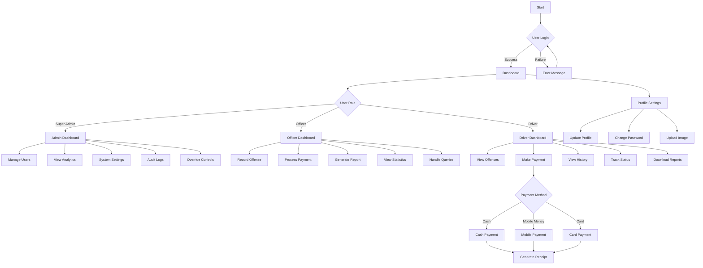
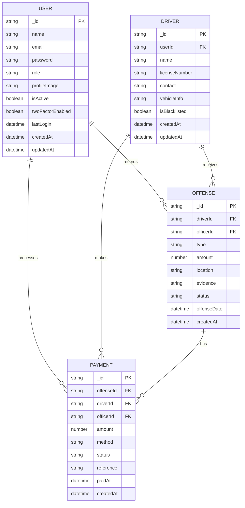
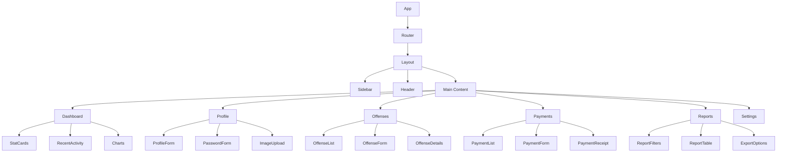
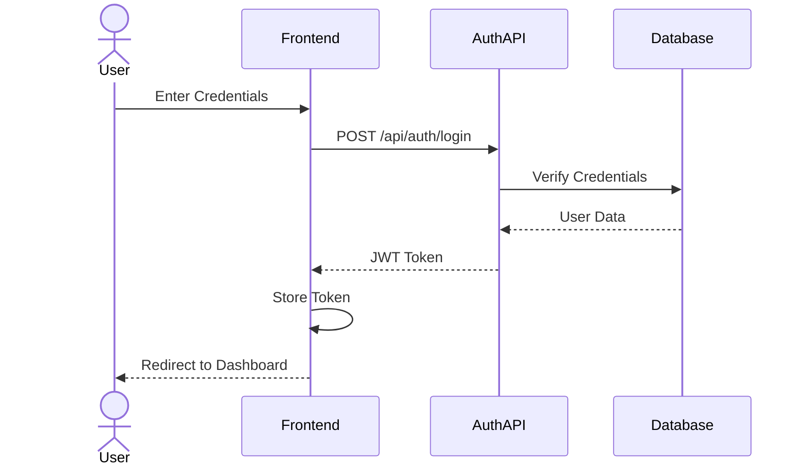
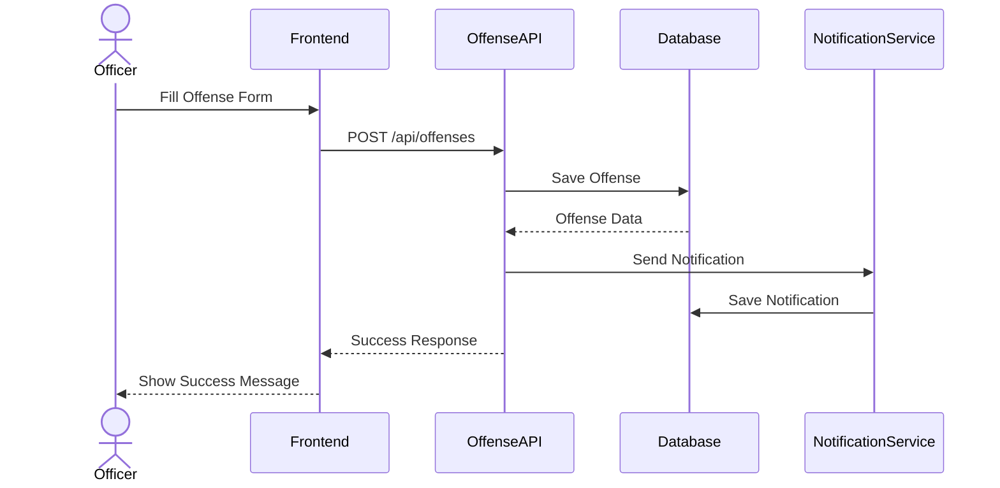
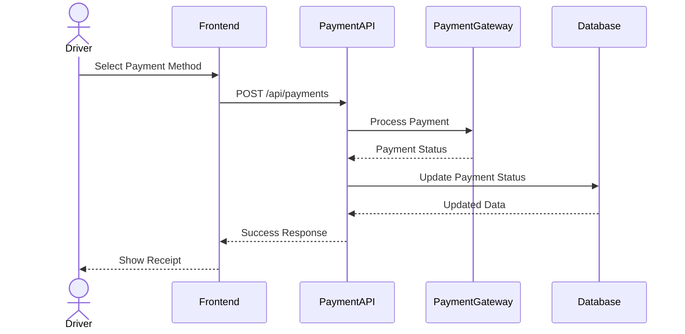
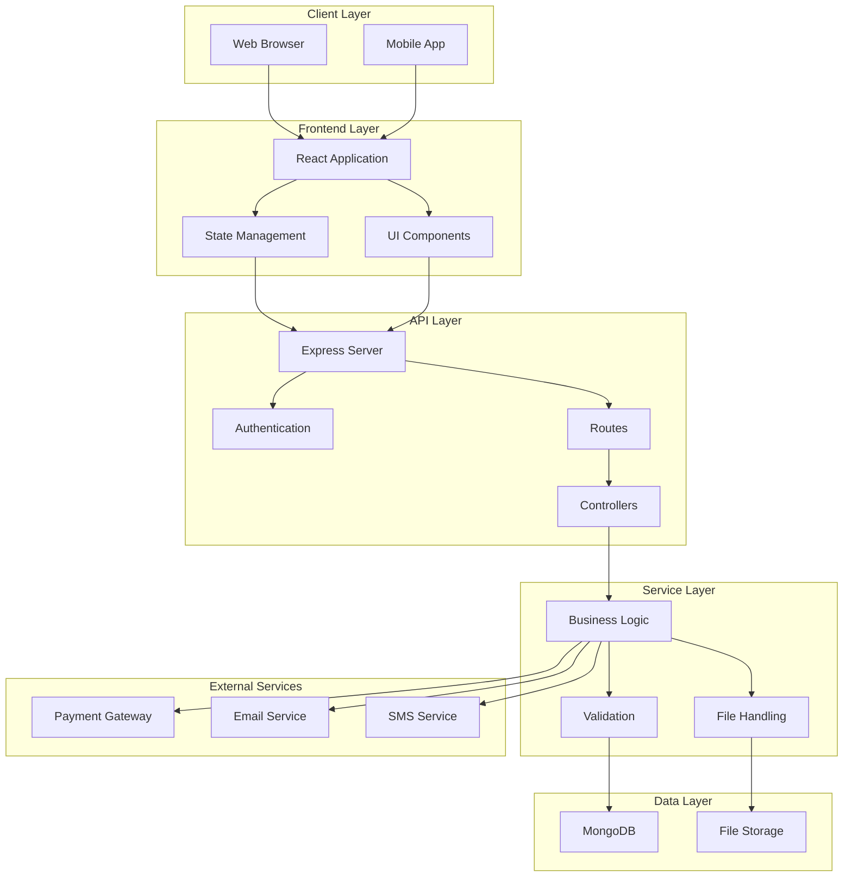

# Traffic System Diagrams

## Table of Contents
1. [System Flowchart](#system-flowchart)
2. [ERD (Entity Relationship Diagram)](#erd)
3. [Frontend Component Diagram](#frontend-component-diagram)
4. [Sequence Diagrams](#sequence-diagrams)
5. [Architecture Diagram](#architecture-diagram)

## System Flowchart

## ERD (Entity Relationship Diagram)

## Frontend Component Diagram

## Sequence Diagrams

### Login Process

### Record Offense Process

### Payment Process

## Architecture Diagram

Note: These diagrams are written in Mermaid markdown syntax. To view them properly, you'll need a markdown viewer that supports Mermaid diagrams (like GitHub, VS Code with Mermaid extension, or other Mermaid-compatible viewers).

The diagrams provide a comprehensive visual representation of your Traffic System including:
1. System workflow from start to end
2. Database relationships and structure
3. Frontend component hierarchy and relationships
4. Key system processes like login, offense recording, and payment
5. Overall system architecture and how different components interact

Would you like me to explain any specific diagram in more detail or make any adjustments?
